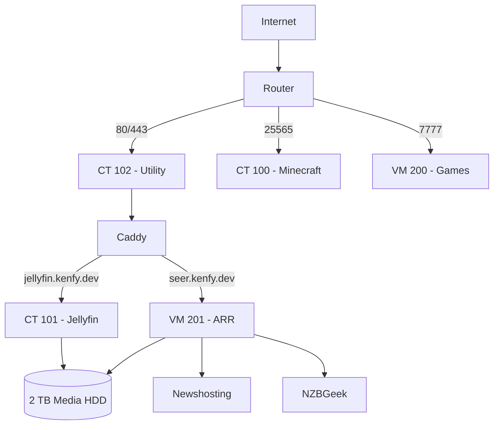

# Home Lab Documentation

This repository documents the current Proxmox home lab, including the media automation stack, Jellyfin, utility services, game servers, networking, storage, and day-to-day operations.

> **Important:** No passwords, API keys, VPN credentials, or other secrets should be committed to this repository.

## High-Level Architecture

## Services

| Service | Host | Local Address | Purpose |
|---|---|---|---|
| Proxmox VE | `pve` | `<PROXMOX_IP>:8006` | Hypervisor |
| Crafty | CT 100 | `<MINECRAFT_IP>:8443` | Minecraft management |
| Jellyfin | CT 101 | `<JELLYFIN_IP>:8096` | Media server |
| Pterodactyl | VM 200 | `<GAMES_IP>` | Game server management |
| Utility | CT 102 | `<UTILITY_IP>` | Caddy, AdGuard, Homepage, Uptime Kuma |
| ARR stack | VM 201 | `<ARR_IP>` | Media automation |

## Public Services

| Public Name | Destination |
|---|---|
| `jellyfin.example.com` | Caddy → Jellyfin |
| `seer.example.com` | Caddy → Seerr |
| `play.example.com:25565` | Minecraft |
| `play.example.com:7777` | Terraria |

The Proxmox UI, Crafty, Radarr, Sonarr, SABnzbd, Prowlarr, Bazarr, AdGuard, Homepage, and Uptime Kuma remain local-only.

## Documentation

- [Architecture](docs/architecture.md)
- [ARR Stack](docs/arr-stack.md)
- [Media Request Flow](docs/media-flow.md)
- [Jellyfin](docs/jellyfin.md)
- [Networking](docs/networking.md)
- [Storage](docs/storage.md)
- [Utility Stack](docs/utility-stack.md)
- [Game Servers](docs/game-servers.md)
- [Operations](docs/operations.md)
- [Troubleshooting](docs/troubleshooting.md)
- [Security Notes](docs/security.md)
- [Subscriptions](docs/subscriptions.md)

## Hardware

- Intel Core i7-8700K — 6 cores / 12 threads
- 32 GiB RAM
- NVIDIA GTX 1080 Ti
- Intel UHD 630 iGPU
- 512 GB NVMe for Proxmox + VM/LXC disks
- 2 TB HDD for media
- 2 TB HDD for backups

The host currently has significant CPU and memory headroom, so the services are intentionally separated for reliability instead of being combined into one large VM.
